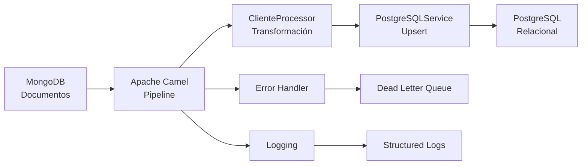

# MongoDB to PostgreSQL Migration with Java 21 

[](https://openjdk.org/projects/jdk/21/)
[](https://spring.io/projects/spring-boot)
[](https://camel.apache.org/)
[](https://maven.apache.org/)
[](https://github.com/andersson30/mongodb-postgresql-migration-java21/actions/workflows/ci.yml)

## Descripción

Solución empresarial completa para migrar datos desde **MongoDB** a **PostgreSQL** utilizando **Java 21** con **Apache Camel**. Implementa las características más modernas de Java incluyendo **Records**, **Text Blocks**, y patrones de programación funcional.

### Características Destacadas

- **Java 21 Records**: Modelos de datos inmutables y concisos
- **Text Blocks**: SQL multilinea legible y mantenible  
- **Apache Camel**: Pipeline ETL robusto y escalable
- **Dual Database**: MongoDB (documentos) → PostgreSQL (relacional)
- **Testcontainers**: Tests de integración con bases de datos reales
- **Logging Estructurado**: Trazabilidad completa del proceso
- **Manejo de Errores**: Reintentos automáticos y dead letter queue

## Arquitectura



### Componentes Principales

| Componente | Tecnología | Propósito |
|------------|------------|-----------|
| **Source DB** | MongoDB 5.0+ | Base de datos de origen con documentos embebidos |
| **ETL Pipeline** | Apache Camel 3.21 | Orquestación de migración y transformación |
| **Data Models** | Java 21 Records | Modelos inmutables con validación integrada |
| **Target DB** | PostgreSQL 13+ | Base de datos relacional normalizada |
| **Functions** | PL/pgSQL | Operaciones upsert optimizadas |
| **Framework** | Spring Boot 2.7 | Inyección de dependencias y configuración |
| **Testing** | Testcontainers | Tests de integración con bases de datos reales |
| **Connection Pool** | HikariCP | Pool de conexiones de alto rendimiento |

## Estructura del Proyecto

```
mongodb-postgresql-migration/
├── src/main/java/com/techtest/
│   ├── MigrationApplication.java          # Aplicación Spring Boot principal
│   ├── config/DatabaseConfig.java         # Configuración dual de BD
│   ├── model/                             # Java 21 Records
│   │   ├── Cliente.java                      # Record inmutable con validación
│   │   └── Direccion.java                    # Record con Jackson annotations
│   ├── processor/ClienteProcessor.java    # Transformación MongoDB → Java
│   ├── route/MigrationRoute.java          # Pipeline Apache Camel
│   └── service/PostgreSQLService.java     # Operaciones PostgreSQL
├── src/main/resources/
│   ├── application.yml                       # Configuración centralizada
│   └── logback-spring.xml                    # Logging estructurado
├── src/test/java/com/techtest/
│   ├── integration/                       # Tests con Testcontainers
│   │   └── MigrationIntegrationTest.java
│   └── processor/                         # Tests unitarios
│       └── ClienteProcessorTest.java
├── scripts/
│   ├── mongodb/                           # Scripts y queries MongoDB
│   │   ├── 01-create-collection.js
│   │   ├── 02-queries.js
│   │   └── README-MongoDB.md
│   └── postgresql/                        # Schema y funciones PL/pgSQL
│       ├── 01-schema.sql
│       ├── 02-functions.sql
│       └── 03-test-data.sql
└── README.md                              # Documentación completa
```
## Características de Java 21

### Records Inmutables
```java
public record Cliente(
    @JsonProperty("_id") String mongoId,
    @JsonProperty("nombre") String nombre,
    @JsonProperty("correo") String correo,
    @JsonProperty("direccion") Direccion direccion
) {
    // Constructor de validación integrado
    public Cliente {
        if (mongoId == null || mongoId.trim().isEmpty()) {
            throw new IllegalArgumentException("El mongoId no puede ser null o vacío");
        }
        // ... más validaciones
    }
}
```

### Text Blocks para SQL
```java
String createClientes = """
    CREATE TABLE IF NOT EXISTS clientes (
        id SERIAL PRIMARY KEY,
        mongo_id VARCHAR(24) UNIQUE NOT NULL,
        nombre VARCHAR(255) NOT NULL,
        correo VARCHAR(255) UNIQUE NOT NULL,
        direccion_id INTEGER NOT NULL,
        created_at TIMESTAMP DEFAULT CURRENT_TIMESTAMP,
        updated_at TIMESTAMP DEFAULT CURRENT_TIMESTAMP,
        CONSTRAINT fk_cliente_direccion 
            FOREIGN KEY (direccion_id) 
            REFERENCES direcciones(id) 
            ON DELETE RESTRICT 
            ON UPDATE CASCADE
    )
    """;
```

### Sintaxis Moderna de Acceso
```java
// Antes (Java 11)
cliente.getNombre()
cliente.getDireccion().getCalle()

// Ahora (Java 21 Records)
cliente.nombre()
cliente.direccion().calle()
```

## Requisitos del Sistema

| Requisito | Versión Mínima | Recomendada |
|-----------|----------------|-------------|
| **Java** | 21 | 21+ |
| **Maven** | 3.6+ | 3.9+ |
| **MongoDB** | 5.0+ | 6.0+ |
| **PostgreSQL** | 13+ | 15+ |
| **Docker** | 20.10+ | 24.0+ |
| **RAM** | 4GB | 8GB+ |

## CI/CD

- __GitHub Actions__: este repo incluye un workflow en `.github/workflows/ci.yml` que:
  - Compila con Java 21 y ejecuta tests (`mvn verify`).
  - Levanta servicios de MongoDB y PostgreSQL en el runner para validar queries y schema.
  - Inicializa PostgreSQL con los scripts de `scripts/postgresql/` y siembra MongoDB con `scripts/mongodb/`.
  - Publica los logs de la app (si existen) como artifacts.
- __Estado__: ver badge al inicio del README.

## Imágenes en README (opcional recomendado)

Para asegurar que las imágenes siempre se rendericen:
- Crea el directorio `docs/assets/` y añade tus capturas allí (por ejemplo, `docs/assets/mongo-insert.png`).
- Enlaza con rutas relativas en el README:
  ```markdown
  
  ```
- Ventajas: no dependes de URLs temporales de `user-attachments` y las imágenes se versionan con el repo.

## Instalación y Configuración

### Prerrequisitos

- **Java 21** (OpenJDK o Oracle JDK)
- **Maven 3.8+**
- **Docker** y **Docker Compose** (recomendado)
- **Git**

### Opción 1: Entorno Docker (Recomendado)

#### 1. Clonar el Proyecto
```bash
git clone https://github.com/andersson30/mongodb-postgresql-migration-java21.git
cd mongodb-postgresql-migration-java21
```

#### 2. Levantar Entorno Docker
```bash
# Navegar al directorio de Docker
cd scripts/Docker

# Levantar todos los servicios
docker-compose up -d

# Verificar que todos los contenedores estén corriendo
docker-compose ps
```

**Servicios incluidos:**
- **MongoDB** (puerto 27017) - Base de datos origen
- **Mongo Express** (puerto 8081) - Admin UI para MongoDB
- **PostgreSQL** (puerto 5432) - Base de datos destino  
- **pgAdmin** (puerto 8080) - Admin UI para PostgreSQL

#### 3. Configurar PostgreSQL
Este repositorio usa docker compose ver scripts/Docker/docker-compose.yml
sin embargo usar la base de datos local si prefieres
```bash
# Ejecutar scripts de inicialización (desde la raíz del proyecto)
cd ../..

# Crear schema y tablas
docker-compose -f scripts/Docker/docker-compose.yml exec postgres-server \
  psql -U postgres -d techtest -f /docker-entrypoint-initdb.d/01-schema.sql

# Crear funciones PL/pgSQL
docker-compose -f scripts/Docker/docker-compose.yml exec postgres-server \
  psql -U postgres -d techtest -f /docker-entrypoint-initdb.d/02-functions.sql

# Insertar datos de prueba
docker-compose -f scripts/Docker/docker-compose.yml exec postgres-server \
  psql -U postgres -d techtest -f /docker-entrypoint-initdb.d/03-test-data.sql
```

#### 4. Configurar MongoDB
```bash
# Conectar a MongoDB y ejecutar scripts
docker-compose -f scripts/Docker/docker-compose.yml exec mongodb-server mongosh techtest

# Dentro de mongosh, ejecutar:
load('/docker-entrypoint-initdb.d/01-create-collection.js')
load('/docker-entrypoint-initdb.d/02-insert-data.js')
exit
```

#### 5. Verificar Configuración

**MongoDB (Mongo Express):**
- Abrir http://localhost:8081
- Navegar a base de datos `techtest` → colección `clientes`
- Verificar que hay 10 documentos

**PostgreSQL (pgAdmin):**
- Abrir http://localhost:8080
- Login: `admin@admin.com` / `admin123`
- Agregar servidor: Host `postgres-server`, Puerto `5432`, Usuario `postgres`, Password `postgres123`
- Verificar base de datos `techtest` con tablas `clientes` y `direcciones`

#### 6. Ejecutar Migración
```bash
# Compilar y ejecutar aplicación
mvn clean compile
mvn spring-boot:run
```

**Resultado esperado:**
```
2025-08-11 12:02:00.232 [Camel] INFO  PostgreSQLService - Verificación de conexión PostgreSQL: OK
2025-08-11 12:02:00.343 [Camel] INFO  ClienteProcessor - Procesando documento MongoDB: 6899ebbe...
2025-08-11 12:02:00.344 [Camel] INFO  ClienteProcessor - Cliente transformado exitosamente: Juan Pérez
2025-08-11 12:02:00.361 [Camel] INFO  PostgreSQLService - Cliente procesado exitosamente. ID PostgreSQL: 1
...
2025-08-11 12:02:00.380 [Camel] INFO  PostgreSQLService - Estadísticas de migración: 10 clientes, 10 direcciones, 5 países, 8 ciudades
```

#### 7. Verificar Migración
```bash
# Verificar datos migrados en PostgreSQL
docker-compose -f scripts/Docker/docker-compose.yml exec postgres-server \
  psql -U postgres -d techtest -c "
    SELECT c.nombre, c.correo, d.calle, d.ciudad, d.pais 
    FROM clientes c 
    JOIN direcciones d ON c.direccion_id = d.id 
    LIMIT 5;"
```

#### 8. Detener Entorno
```bash
# Detener todos los servicios
cd scripts/Docker
docker-compose down

# Detener y eliminar volúmenes (CUIDADO: elimina datos)
docker-compose down -v
```

### Opción 2: Instalación Local

Si prefieres instalar las bases de datos localmente:

#### MongoDB Local
```bash
# macOS
brew install mongodb-community
brew services start mongodb-community

# Ubuntu/Debian
sudo apt-get install mongodb
sudo systemctl start mongodb

# Verificar
mongosh --eval "db.adminCommand('ismaster')"
```

#### PostgreSQL Local
```bash
# macOS  
brew install postgresql
brew services start postgresql
createdb techtest

# Ubuntu/Debian
sudo apt-get install postgresql postgresql-contrib
sudo systemctl start postgresql
sudo -u postgres createdb techtest

# Verificar
psql -d techtest -c "SELECT version();"
```

## Uso del Sistema

### Pipeline de Migración Automática

La aplicación está configurada para ejecutar la migración automáticamente al iniciar:

1. **Timer de Apache Camel** se activa después de 1 segundo
2. **Lee todos los documentos** de MongoDB (`techtest.clientes`)
3. **Transforma cada documento** usando Java 21 records
4. **Guarda en PostgreSQL** usando funciones PL/pgSQL optimizadas
5. **Muestra estadísticas finales** de migración

### Monitoreo en Tiempo Real

**Logs estructurados:**
- Consola: Output en tiempo real con colores
- `logs/migration.log`: Log completo con rotación
- `logs/migration-error.log`: Solo errores y warnings

**Interfaces de administración:**
- **Mongo Express**: http://localhost:8081 (MongoDB)
- **pgAdmin**: http://localhost:8080 (PostgreSQL)

### Re-ejecutar Migración
```bash
# Limpiar datos de PostgreSQL
docker-compose -f scripts/Docker/docker-compose.yml exec postgres-server \
  psql -U postgres -d techtest -c "DELETE FROM clientes; DELETE FROM direcciones;"

# Re-ejecutar aplicación
mvn spring-boot:run
```

## Deployment

### Docker Compose Completo

El archivo `scripts/Docker/docker-compose.yml` incluye:

```yaml
version: '3.8'

services:
  # MongoDB + Admin UI
  mongodb-server:
    image: mongo:6.0
    container_name: mongodb-server
    ports:
      - "27017:27017"
    volumes:
      - mongodb_data:/data/db
      - ../mongodb:/docker-entrypoint-initdb.d
    networks:
      - migration-network

  mongo-express:
    image: mongo-express:1.0.0-alpha
    container_name: mongo-express
    ports:
      - "8081:8081"
    environment:
      ME_CONFIG_MONGODB_SERVER: mongodb-server
      ME_CONFIG_MONGODB_PORT: 27017
    depends_on:
      - mongodb-server
    networks:
      - migration-network

  # PostgreSQL + Admin UI  
  postgres-server:
    image: postgres:15
    container_name: postgres-server
    ports:
      - "5432:5432"
    environment:
      POSTGRES_DB: techtest
      POSTGRES_USER: postgres
      POSTGRES_PASSWORD: postgres123
    volumes:
      - postgres_data:/var/lib/postgresql/data
      - ../postgresql:/docker-entrypoint-initdb.d
    networks:
      - migration-network

  pgadmin:
    image: dpage/pgadmin4:7
    container_name: pgadmin
    ports:
      - "8080:80"
    environment:
      PGADMIN_DEFAULT_EMAIL: admin@admin.com
      PGADMIN_DEFAULT_PASSWORD: admin123
    depends_on:
      - postgres-server
    networks:
      - migration-network

volumes:
  mongodb_data:
  postgres_data:

networks:
  migration-network:
    driver: bridge
