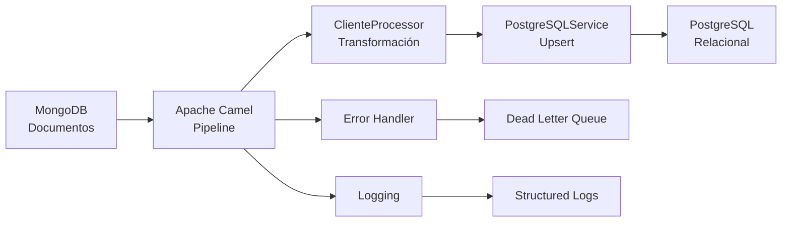

# MongoDB to PostgreSQL Migration with Java 21 

[](https://openjdk.org/projects/jdk/21/)
[](https://spring.io/projects/spring-boot)
[](https://camel.apache.org/)
[](https://maven.apache.org/)


## Descripción

Solución empresarial completa para migrar datos desde **MongoDB** a **PostgreSQL** utilizando **Java 21** con **Apache Camel**. Implementa las características más modernas de Java incluyendo **Records**, **Text Blocks**, y patrones de programación funcional.

### Características Destacadas

- **Java 21 Records**: Modelos de datos inmutables y concisos
- **Text Blocks**: SQL multilinea legible y mantenible  
- **Apache Camel**: Pipeline ETL robusto y escalable
- **Dual Database**: MongoDB (documentos) → PostgreSQL (relacional)
- **Testcontainers**: Tests de integración con bases de datos reales
- **Logging Estructurado**: Trazabilidad completa del proceso
- **Manejo de Errores**: Reintentos automáticos y dead letter queue

## Arquitectura



### Componentes Principales

| Componente | Tecnología | Propósito |
|------------|------------|-----------|
| **Source DB** | MongoDB 5.0+ | Base de datos de origen con documentos embebidos |
| **ETL Pipeline** | Apache Camel 3.21 | Orquestación de migración y transformación |
| **Data Models** | Java 21 Records | Modelos inmutables con validación integrada |
| **Target DB** | PostgreSQL 13+ | Base de datos relacional normalizada |
| **Functions** | PL/pgSQL | Operaciones upsert optimizadas |
| **Framework** | Spring Boot 2.7 | Inyección de dependencias y configuración |
| **Testing** | Testcontainers | Tests de integración con bases de datos reales |
| **Connection Pool** | HikariCP | Pool de conexiones de alto rendimiento |

## Estructura del Proyecto

```
mongodb-postgresql-migration/
├── src/main/java/com/techtest/
│   ├── MigrationApplication.java          # Aplicación Spring Boot principal
│   ├── config/DatabaseConfig.java         # Configuración dual de BD
│   ├── model/                             # Java 21 Records
│   │   ├── Cliente.java                      # Record inmutable con validación
│   │   └── Direccion.java                    # Record con Jackson annotations
│   ├── processor/ClienteProcessor.java    # Transformación MongoDB → Java
│   ├── route/MigrationRoute.java          # Pipeline Apache Camel
│   └── service/PostgreSQLService.java     # Operaciones PostgreSQL
├── src/main/resources/
│   ├── application.yml                       # Configuración centralizada
│   └── logback-spring.xml                    # Logging estructurado
├── src/test/java/com/techtest/
│   ├── integration/                       # Tests con Testcontainers
│   │   └── MigrationIntegrationTest.java
│   └── processor/                         # Tests unitarios
│       └── ClienteProcessorTest.java
├── scripts/
│   ├── mongodb/                           # Scripts y queries MongoDB
│   │   ├── 01-create-collection.js
│   │   ├── 02-queries.js
│   │   └── README-MongoDB.md
│   └── postgresql/                        # Schema y funciones PL/pgSQL
│       ├── 01-schema.sql
│       ├── 02-functions.sql
│       └── 03-test-data.sql
└── README.md                              # Documentación completa
```
## Características de Java 21

### Records Inmutables
```java
public record Cliente(
    @JsonProperty("_id") String mongoId,
    @JsonProperty("nombre") String nombre,
    @JsonProperty("correo") String correo,
    @JsonProperty("direccion") Direccion direccion
) {
    // Constructor de validación integrado
    public Cliente {
        if (mongoId == null || mongoId.trim().isEmpty()) {
            throw new IllegalArgumentException("El mongoId no puede ser null o vacío");
        }
        // ... más validaciones
    }
}
```

### Text Blocks para SQL
```java
String createClientes = """
    CREATE TABLE IF NOT EXISTS clientes (
        id SERIAL PRIMARY KEY,
        mongo_id VARCHAR(24) UNIQUE NOT NULL,
        nombre VARCHAR(255) NOT NULL,
        correo VARCHAR(255) UNIQUE NOT NULL,
        direccion_id INTEGER NOT NULL,
        created_at TIMESTAMP DEFAULT CURRENT_TIMESTAMP,
        updated_at TIMESTAMP DEFAULT CURRENT_TIMESTAMP,
        CONSTRAINT fk_cliente_direccion 
            FOREIGN KEY (direccion_id) 
            REFERENCES direcciones(id) 
            ON DELETE RESTRICT 
            ON UPDATE CASCADE
    )
    """;
```

### Sintaxis Moderna de Acceso
```java
// Antes (Java 11)
cliente.getNombre()
cliente.getDireccion().getCalle()

// Ahora (Java 21 Records)
cliente.nombre()
cliente.direccion().calle()
```

## Requisitos del Sistema

| Requisito | Versión Mínima | Recomendada |
|-----------|----------------|-------------|
| **Java** | 21 | 21+ |
| **Maven** | 3.6+ | 3.9+ |
| **MongoDB** | 5.0+ | 6.0+ |
| **PostgreSQL** | 13+ | 15+ |
| **Docker** | 20.10+ | 24.0+ |
| **RAM** | 4GB | 8GB+ |

## Instalación y Configuración

### 1. Clonar y configurar el proyecto
```bash
git clone https://github.com/andersson30/mongodb-postgresql-migration-java21.git
cd mongodb-postgresql-migration
```

### 2. Configurar bases de datos

#### Configurar MongoDB:
```bash
# Ejecutar script de creación de datos
mongo mongodb://localhost:27017/techtest scripts/mongodb/01-create-collection.js

# Ejecutar consultas de ejemplo
mongo mongodb://localhost:27017/techtest scripts/mongodb/02-queries.js
```

#### Configurar PostgreSQL:
```bash
# Crear schema y tablas
psql -U postgres -d techtest -f scripts/postgresql/01-schema.sql

# Crear funciones PL/pgSQL
psql -U postgres -d techtest -f scripts/postgresql/02-functions.sql

# Insertar datos de prueba
psql -U postgres -d techtest -f scripts/postgresql/03-test-data.sql
```

### 3. Configurar aplicación Java

Editar `src/main/resources/application.yml` si es necesario:

```yaml
mongodb:
  connection:
    uri: mongodb://localhost:27017
  database:
    name: techtest

postgresql:
  url: jdbc:postgresql://localhost:5432/techtest
  username: postgres
  password: postgres
```

## Ejecución

### 1. Compilar el proyecto
```bash
mvn clean compile
```

### 2. Ejecutar pruebas
```bash
# Pruebas unitarias
mvn test

# Pruebas de integración (requiere Docker)
mvn verify
```

### 3. Ejecutar la aplicación
```bash
# Opción 1: Maven
mvn spring-boot:run

# Opción 2: JAR
mvn clean package
java -jar target/mongodb-postgresql-migration-1.0.0.jar
```

### 4. Verificar migración

La aplicación ejecutará automáticamente la migración al iniciar. Verificar logs:

```bash
tail -f logs/migration.log
```

Verificar datos en PostgreSQL:
```sql
-- Contar registros migrados
SELECT COUNT(*) FROM clientes;
SELECT COUNT(*) FROM direcciones;

-- Ver datos migrados
SELECT c.nombre, c.correo, d.calle, d.ciudad, d.pais 
FROM clientes c 
JOIN direcciones d ON c.direccion_id = d.id;
```

## Funcionalidades Implementadas

### Módulo 1: MongoDB
- Colección `clientes` con documentos embebidos
- 10 documentos de prueba con datos variados
- Consultas por país y actualización de correo
- Índices optimizados para consultas
- Análisis de documentos embebidos vs referencias

### Módulo 2: PostgreSQL + PL/pgSQL
- Tablas `clientes` y `direcciones` con integridad referencial
- Función `upsert_cliente()` para INSERT/UPDATE
- Función `upsert_direccion()` para normalización
- Procedimiento `obtener_clientes_por_pais()`
- Triggers para `updated_at` automático
- Datos de prueba para validación

### Módulo 3: Java + Apache Camel
- Proyecto Maven con Spring Boot
- Conexión a MongoDB y PostgreSQL
- Transformación de documentos a modelo relacional
- Rutas Camel con manejo de errores y reintentos
- Logging detallado en cada paso
- Pool de conexiones optimizado (HikariCP)

### Testing
- Pruebas unitarias para transformación de datos
- Pruebas de integración con Testcontainers
- Verificación de migración completa
- Testing de casos edge (direcciones duplicadas, errores)

## Características Técnicas

### Manejo de Errores
- Reintentos automáticos: 3 intentos con backoff exponencial
- Dead Letter Queue: Mensajes fallidos se registran para análisis
- Logging detallado: Cada error se registra con contexto completo

### Optimizaciones
- Pool de conexiones: HikariCP para PostgreSQL
- Índices de BD: Optimizados para consultas frecuentes
- Upsert inteligente: Evita duplicados de direcciones
- Streaming: Procesamiento de grandes volúmenes sin cargar todo en memoria

### Logging
- Archivo rotativo: `logs/migration.log` con rotación
- Niveles configurables: INFO para aplicación, WARN para librerías
- Formato estructurado: Timestamp, thread, nivel, logger, mensaje

## Casos de Uso Cubiertos

1. Migración inicial completa: Todos los documentos de MongoDB a PostgreSQL
2. Actualizaciones incrementales: Re-ejecutar migración actualiza registros existentes
3. Direcciones compartidas: Múltiples clientes con la misma dirección (normalización)
4. Manejo de errores: Documentos malformados o errores de conexión
5. Monitoreo: Logs y métricas para supervisión

## Comandos Útiles

### MongoDB
```bash
# Conectar a MongoDB
mongo mongodb://localhost:27017/techtest

# Ver documentos
db.clientes.find().pretty()

# Contar por país
db.clientes.aggregate([{$group: {_id: "$direccion.pais", total: {$sum: 1}}}])
```

### PostgreSQL
```bash
# Conectar a PostgreSQL
psql -U postgres -d techtest

# Ver estadísticas
SELECT * FROM obtener_estadisticas_migracion();

# Ver clientes por país
SELECT * FROM obtener_clientes_por_pais('España');
```
### Aplicación
```bash
# Ver logs en tiempo real
tail -f logs/migration.log

# Verificar salud de la aplicación
curl http://localhost:8080/actuator/health

# Ver rutas Camel
curl http://localhost:8080/actuator/camel/routes
```

## Troubleshooting

### Problemas comunes:

1. Error de conexión MongoDB
   ```
   Verificar que MongoDB esté ejecutándose: brew services list
   Verificar puerto: netstat -an | grep 27017
   ```

2. Error de conexión PostgreSQL
   ```
   Verificar servicio: brew services list
   Verificar base de datos: psql -l
   ```

3. Errores de compilación
   ```
   Limpiar y recompilar: mvn clean compile
   Verificar Java version: java -version
   ```

4. Pruebas fallan
   ```
   Verificar Docker: docker --version
   Limpiar contenedores: docker system prune
   ```

## Próximos Pasos

Para extender esta solución:

1. Monitoreo avanzado: Integrar Micrometer/Prometheus
2. Configuración externa: Usar Spring Cloud Config
3. Procesamiento batch: Implementar Spring Batch para grandes volúmenes
4. API REST: Exponer endpoints para control manual de migración
5. Notificaciones: Alertas por email/Slack en caso de errores


---

Versión: 1.0.0  
Fecha: 2025-08-11  
Autor: Andersson Avila Rojas

## Cumplimiento de requisitos y guía de entrega

Esta sección mapea los requisitos del enunciado con lo implementado y provee los comandos exactos para validarlo y adjuntar evidencias.

### Módulo 1: MongoDB y modelado
- __Colección `clientes` con `direccion` embebida__: definida en `scripts/mongodb/01-create-collection.js` y poblada en `02-insert-data.js` (10 documentos).
  
- __Consultas requeridas__:
  - Listar clientes por país (ejemplo: España):
    ```bash
    docker-compose -f scripts/Docker/docker-compose.yml exec mongodb-server \
      mongosh --quiet --eval "use techtest; db.clientes.find({ 'direccion.pais': 'España' }).pretty()"
    ```
  - Actualizar correo electrónico de un cliente (por nombre o _id):
    ```bash
    # Por nombre
    docker-compose -f scripts/Docker/docker-compose.yml exec mongodb-server \
      mongosh --quiet --eval "use techtest; db.clientes.updateOne({ nombre: 'Juan Pérez' }, { $set: { correo: 'juan.perez@nuevo.com' } })"

    # Por _id (6899ebbedbc39a17b874e39a)
    docker-compose -f scripts/Docker/docker-compose.yml exec mongodb-server \
      mongosh --quiet --eval "use techtest; db.clientes.updateOne({ _id: ObjectId('6899ebbedbc39a17b874e39a') }, { $set: { correo: 'nuevo@mail.com' } })"
    ```
    

## Modelado en MongoDB: Embebidos vs Referencias

En este proyecto, la colección `clientes` en MongoDB almacena la dirección como un documento embebido (`direccion`) dentro del cliente. Durante la migración, se transforma a un modelo relacional en PostgreSQL donde `clientes.direccion_id` referencia a la tabla `direcciones`.

- __Embebidos (como `clientes.direccion`)__
  - Ventajas:
    - Lecturas rápidas: una sola consulta devuelve el cliente con su dirección.
    - Atomicidad: actualizaciones de cliente+dirección en una operación (a nivel de documento).
    - Simplicidad: ideal para relaciones 1:1 o 1:pocos y datos que se consultan siempre juntos.
  - Desventajas:
    - Duplicación: si muchas personas comparten la misma dirección, se repite en múltiples documentos.
    - Actualizaciones globales costosas: cambiar una calle común exige actualizar muchos documentos.
    - Tamaño de documento: riesgo de crecer hacia el límite de 16MB si se embeben muchos subdocumentos.

- __Referencias (colecciones separadas + `$lookup`)__
  - Ventajas:
    - Normalización: evita duplicados (una sola `direccion` referenciada por varios `clientes`).
    - Mantenibilidad: actualizar una dirección se refleja en todos los clientes que la referencian.
    - Escalabilidad: mejor para relaciones muchos-a-muchos y datos compartidos.
  - Desventajas:
    - Más consultas o `$lookup`: puede impactar rendimiento en lecturas intensivas.
    - Complejidad: mayor lógica en consultas y agregaciones.
    - No hay atomicidad entre colecciones: operaciones multi-documento no son atómicas por defecto.

__Guía rápida__
- Usa embebidos cuando: relación 1:1 o 1:pocos, acceso conjunto frecuente, cambios poco frecuentes, lectura rápida prioritaria.
- Usa referencias cuando: datos compartidos por muchos documentos, actualizaciones frecuentes, relaciones complejas o riesgo de duplicación.

__Aplicación en este repositorio__
- MongoDB: `clientes` con `direccion` embebida (desarrollo simple y lecturas rápidas).
- PostgreSQL: `clientes` y `direcciones` normalizados con foreign key (`direccion_id`) para consistencia y reutilización.


### Módulo 2: PostgreSQL y PL/pgSQL
- __Tablas `clientes` y `direcciones` con FK__: definidas en `scripts/postgresql/01-schema.sql`.
- __Funciones/Procedimientos__:
  - Upsert de cliente y dirección: `upsert_cliente()` (y `upsert_direccion()`) en `scripts/postgresql/02-functions.sql`.
  - Obtener clientes por país: `obtener_clientes_por_pais(pais TEXT)` en `02-functions.sql`.
- __Datos de prueba__: `scripts/postgresql/03-test-data.sql`.
- __Ejemplos de uso (en el contenedor)__:
  ```bash
  # Invocar upsert de un cliente (ejemplo)
  docker-compose -f scripts/Docker/docker-compose.yml exec postgres-server \
    psql -U postgres -d techtest -c "SELECT upsert_cliente('6899ebbedbc39a17b874e39a', 'Juan Pérez', 'juan.perez@nuevo.com', 'Calle Principal 123', 'Madrid', 'España');"

  # Consultar clientes por país via procedimiento/función
  docker-compose -f scripts/Docker/docker-compose.yml exec postgres-server \
    psql -U postgres -d techtest -c "SELECT * FROM obtener_clientes_por_pais('España');"
  ```


### Módulo 3: Java + Apache Camel
- __Lectura de MongoDB__, __transformación__ y __upsert en PostgreSQL__: definidos en `src/main/java/com/techtest/route/MigrationRoute.java`, `processor/ClienteProcessor.java` y `service/PostgreSQLService.java`.
- __Logging y manejo de errores__: configurados vía Spring Boot logging y rutas Camel con dead-letter.
- __Test__: ejecutar al menos uno para validar inserción de MongoDB → PostgreSQL:
  ```bash
  # Unit/integration tests
  mvn test
  # (Opcional) integración específica si aplica
  mvn -Dtest=MigrationIntegrationTest test
  ```


### Módulo 4: Git y entrega
- __Repositorio Git__: inicializado, commits semánticos y README completo.
- __Instrucciones Docker/local__: ver secciones "Opción 1: Entorno Docker" y "Opción 2: Instalación Local".
- __Compilar, correr y probar__: ver secciones "Ejecutar Migración" y "Testing".

### Evidencia de migración exitosa
Incluye en el README (debajo de esta sección) o en la sección "Evidencia del despliegue":
- __Capturas MongoDB__ (Mongo Express):
  - Inserción de 10 documentos en `techtest.clientes`.
  - Consulta filtrando por país (p. ej., España).
  - Actualización de correo de un cliente (antes/después si es posible).
- __Logs de la aplicación__ (con Camel):
  - Inicio de migración, procesamiento de clientes y estadísticas finales (ej.: "10 clientes, 10 direcciones, 5 países, 8 ciudades").
- __Consulta en PostgreSQL__:
  - Salida de `SELECT COUNT(*) FROM clientes;` y `SELECT COUNT(*) FROM direcciones;`.
  - Muestra de `SELECT c.nombre, c.correo, d.calle, d.ciudad, d.pais FROM clientes c JOIN direcciones d ON c.direccion_id = d.id LIMIT 5;`.

__Placeholders para imágenes__


## CI/CD (GitHub Actions)

Esta sección documenta el pipeline de Integración Continua definido en `/.github/workflows/ci.yml`.

- __Disparadores__:
  - Push y Pull Request a la rama `main` (ajustable en `on:` del workflow).
- __Estrategia__:
  - Java 21 con Temurin en Ubuntu runner.
  - Maven sin output de transferencia (`-ntp`) y modo batch (`-B`).
  - Uso de Testcontainers para MongoDB y PostgreSQL durante pruebas de integración.
  - Publicación de artifacts (logs) para diagnóstico.
### Flujo del pipeline

1) __Checkout del repo__
2) __Setup de JDK 21__ (Temurin)
3) __Cache de Maven__ (`~/.m2/repository`) para acelerar builds
4) __Compilación rápida__: `mvn -B -ntp -DskipTests package`
5) __Pruebas unitarias__: `mvn -B -ntp test`
6) __Pruebas de integración__: `mvn -B -ntp -DskipITs=false verify`
7) __Publicación de logs ()__: artifact `app-logs` con contenido de `logs/**`


## Instalación y Configuración

### Prerrequisitos

- **Java 21** (OpenJDK o Oracle JDK)
- **Maven 3.8+**
- **Docker** y **Docker Compose** (recomendado)
- **Git**

### Opción 1: Entorno Docker (Recomendado)

#### 1. Clonar el Proyecto
```bash
git clone https://github.com/andersson30/mongodb-postgresql-migration-java21.git
cd mongodb-postgresql-migration-java21
```

#### 2. Levantar Entorno Docker
```bash
# Navegar al directorio de Docker
cd scripts/Docker

# Levantar todos los servicios
docker-compose up -d

# Verificar que todos los contenedores estén corriendo
docker-compose ps
```

**Servicios incluidos:**
- **MongoDB** (puerto 27017) - Base de datos origen
- **Mongo Express** (puerto 8081) - Admin UI para MongoDB
- **PostgreSQL** (puerto 5432) - Base de datos destino  
- **pgAdmin** (puerto 8080) - Admin UI para PostgreSQL

#### 3. Configurar PostgreSQL
Este repositorio usa docker compose ver scripts/Docker/docker-compose.yml
sin embargo usar la base de datos local si prefieres
```bash
# Ejecutar scripts de inicialización (desde la raíz del proyecto)
cd ../..

# Crear schema y tablas
docker-compose -f scripts/Docker/docker-compose.yml exec postgres-server \
  psql -U postgres -d techtest -f /docker-entrypoint-initdb.d/01-schema.sql

# Crear funciones PL/pgSQL
docker-compose -f scripts/Docker/docker-compose.yml exec postgres-server \
  psql -U postgres -d techtest -f /docker-entrypoint-initdb.d/02-functions.sql

# Insertar datos de prueba
docker-compose -f scripts/Docker/docker-compose.yml exec postgres-server \
  psql -U postgres -d techtest -f /docker-entrypoint-initdb.d/03-test-data.sql
```

### 4. Configurar MongoDB
```bash
# Iniciar los contenedores
docker-compose -f scripts/Docker/docker-compose.yml up -d

# Verificar que los contenedores están ejecutándose
docker-compose -f scripts/Docker/docker-compose.yml ps

# Copiar script de inicialización al contenedor
docker cp scripts/mongodb/01-create-collection.js mongo-server:/tmp/

# Ejecutar script de inicialización MongoDB
docker-compose -f scripts/Docker/docker-compose.yml exec mongo-server mongosh techtest /tmp/01-create-collection.js

# Verificar que los datos se insertaron correctamente
docker-compose -f scripts/Docker/docker-compose.yml exec mongo-server mongosh techtest --eval "db.clientes.countDocuments()"
```

#### 5. Verificar Configuración

**MongoDB (Mongo Express):**
- Abrir http://localhost:8081
- Navegar a base de datos `techtest` → colección `clientes`
- Verificar que hay 10 documentos

**PostgreSQL (pgAdmin):**
- Abrir http://localhost:8080
- Login: `admin@admin.com` / `admin123`
- Agregar servidor: Host `postgres-server`, Puerto `5432`, Usuario `postgres`, Password `postgres123`
- Verificar base de datos `techtest` con tablas `clientes` y `direcciones`

#### 6. Ejecutar Migración
```bash
# Compilar y ejecutar aplicación
mvn clean compile
mvn spring-boot:run
```

**Resultado esperado:**
```
2025-08-11 12:02:00.232 [Camel] INFO  PostgreSQLService - Verificación de conexión PostgreSQL: OK
2025-08-11 12:02:00.343 [Camel] INFO  ClienteProcessor - Procesando documento MongoDB: 6899ebbe...
2025-08-11 12:02:00.344 [Camel] INFO  ClienteProcessor - Cliente transformado exitosamente: Juan Pérez
2025-08-11 12:02:00.361 [Camel] INFO  PostgreSQLService - Cliente procesado exitosamente. ID PostgreSQL: 1
...
2025-08-11 12:02:00.380 [Camel] INFO  PostgreSQLService - Estadísticas de migración: 10 clientes, 10 direcciones, 5 países, 8 ciudades
```

#### 7. Verificar Migración
```bash
# Verificar datos migrados en PostgreSQL
docker-compose -f scripts/Docker/docker-compose.yml exec postgres-server \
  psql -U postgres -d techtest -c "
    SELECT c.nombre, c.correo, d.calle, d.ciudad, d.pais 
    FROM clientes c 
    JOIN direcciones d ON c.direccion_id = d.id 
    LIMIT 5;"
```

#### 8. Detener Entorno
```bash
# Detener todos los servicios
cd scripts/Docker
docker-compose down

# Detener y eliminar volúmenes (CUIDADO: elimina datos)
docker-compose down -v
```

### Opción 2: Instalación Local

Si prefieres instalar las bases de datos localmente:

#### MongoDB Local
```bash
# macOS
brew install mongodb-community
brew services start mongodb-community

# Ubuntu/Debian
sudo apt-get install mongodb
sudo systemctl start mongodb

# Verificar
mongosh --eval "db.adminCommand('ismaster')"
```

#### PostgreSQL Local
```bash
# macOS  
brew install postgresql
brew services start postgresql
createdb techtest

# Ubuntu/Debian
sudo apt-get install postgresql postgresql-contrib
sudo systemctl start postgresql
sudo -u postgres createdb techtest

# Verificar
psql -d techtest -c "SELECT version();"
```

## Uso del Sistema

### Pipeline de Migración Automática

La aplicación está configurada para ejecutar la migración automáticamente al iniciar:

1. **Timer de Apache Camel** se activa después de 1 segundo
2. **Lee todos los documentos** de MongoDB (`techtest.clientes`)
3. **Transforma cada documento** usando Java 21 records
4. **Guarda en PostgreSQL** usando funciones PL/pgSQL optimizadas
5. **Muestra estadísticas finales** de migración

### Monitoreo en Tiempo Real

**Logs estructurados:**
- Consola: Output en tiempo real con colores
- `logs/migration.log`: Log completo con rotación
- `logs/migration-error.log`: Solo errores y warnings

**Interfaces de administración:**
- **Mongo Express**: http://localhost:8081 (MongoDB)
- **pgAdmin**: http://localhost:8080 (PostgreSQL)

### Re-ejecutar Migración
```bash
# Limpiar datos de PostgreSQL
docker-compose -f scripts/Docker/docker-compose.yml exec postgres-server \
  psql -U postgres -d techtest -c "DELETE FROM clientes; DELETE FROM direcciones;"

# Re-ejecutar aplicación
mvn spring-boot:run
```

## Deployment

### Docker Compose Completo

El archivo `scripts/Docker/docker-compose.yml` incluye:

```yaml
version: '3.8'

services:
  # MongoDB + Admin UI
  mongodb-server:
    image: mongo:6.0
    container_name: mongodb-server
    ports:
      - "27017:27017"
    volumes:
      - mongodb_data:/data/db
      - ../mongodb:/docker-entrypoint-initdb.d
    networks:
      - migration-network

  mongo-express:
    image: mongo-express:1.0.0-alpha
    container_name: mongo-express
    ports:
      - "8081:8081"
    environment:
      ME_CONFIG_MONGODB_SERVER: mongodb-server
      ME_CONFIG_MONGODB_PORT: 27017
    depends_on:
      - mongodb-server
    networks:
      - migration-network

  # PostgreSQL + Admin UI  
  postgres-server:
    image: postgres:15
    container_name: postgres-server
    ports:
      - "5432:5432"
    environment:
      POSTGRES_DB: techtest
      POSTGRES_USER: postgres
      POSTGRES_PASSWORD: postgres123
    volumes:
      - postgres_data:/var/lib/postgresql/data
      - ../postgresql:/docker-entrypoint-initdb.d
    networks:
      - migration-network

  pgadmin:
    image: dpage/pgadmin4:7
    container_name: pgadmin
    ports:
      - "8080:80"
    environment:
      PGADMIN_DEFAULT_EMAIL: admin@admin.com
      PGADMIN_DEFAULT_PASSWORD: admin123
    depends_on:
      - postgres-server
    networks:
      - migration-network

volumes:
  mongodb_data:
  postgres_data:

networks:
  migration-network:
    driver: bridge
```


