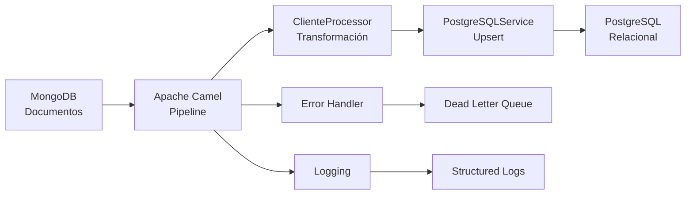

# MongoDB to PostgreSQL Migration with Java 21 🚀

[](https://openjdk.org/projects/jdk/21/)
[](https://spring.io/projects/spring-boot)
[](https://camel.apache.org/)
[](https://maven.apache.org/)


## 📋 Descripción

Solución empresarial completa para migrar datos desde **MongoDB** a **PostgreSQL** utilizando **Java 21** con **Apache Camel**. Implementa las características más modernas de Java incluyendo **Records**, **Text Blocks**, y patrones de programación funcional.

### ✨ Características Destacadas

- 🎯 **Java 21 Records**: Modelos de datos inmutables y concisos
- 📝 **Text Blocks**: SQL multilinea legible y mantenible  
- 🔄 **Apache Camel**: Pipeline ETL robusto y escalable
- 🗃️ **Dual Database**: MongoDB (documentos) → PostgreSQL (relacional)
- 🧪 **Testcontainers**: Tests de integración con bases de datos reales
- 📊 **Logging Estructurado**: Trazabilidad completa del proceso
- 🛡️ **Manejo de Errores**: Reintentos automáticos y dead letter queue

## 🏗️ Arquitectura



### 🧩 Componentes Principales

| Componente | Tecnología | Propósito |
|------------|------------|-----------|
| **Source DB** | MongoDB 5.0+ | Base de datos de origen con documentos embebidos |
| **ETL Pipeline** | Apache Camel 3.21 | Orquestación de migración y transformación |
| **Data Models** | Java 21 Records | Modelos inmutables con validación integrada |
| **Target DB** | PostgreSQL 13+ | Base de datos relacional normalizada |
| **Functions** | PL/pgSQL | Operaciones upsert optimizadas |
| **Framework** | Spring Boot 2.7 | Inyección de dependencias y configuración |
| **Testing** | Testcontainers | Tests de integración con bases de datos reales |
| **Connection Pool** | HikariCP | Pool de conexiones de alto rendimiento |

## 📁 Estructura del Proyecto

```
mongodb-postgresql-migration/
├── 📁 src/main/java/com/techtest/
│   ├── 🚀 MigrationApplication.java          # Aplicación Spring Boot principal
│   ├── ⚙️ config/DatabaseConfig.java         # Configuración dual de BD
│   ├── 🎯 model/                             # Java 21 Records
│   │   ├── Cliente.java                      # Record inmutable con validación
│   │   └── Direccion.java                    # Record con Jackson annotations
│   ├── 🔄 processor/ClienteProcessor.java    # Transformación MongoDB → Java
│   ├── 🛤️ route/MigrationRoute.java          # Pipeline Apache Camel
│   └── 🗃️ service/PostgreSQLService.java     # Operaciones PostgreSQL
├── 📁 src/main/resources/
│   ├── application.yml                       # Configuración centralizada
│   └── logback-spring.xml                    # Logging estructurado
├── 📁 src/test/java/com/techtest/
│   ├── 🧪 integration/                       # Tests con Testcontainers
│   │   └── MigrationIntegrationTest.java
│   └── ⚡ processor/                         # Tests unitarios
│       └── ClienteProcessorTest.java
├── 📁 scripts/
│   ├── 🍃 mongodb/                           # Scripts y queries MongoDB
│   │   ├── 01-create-collection.js
│   │   ├── 02-queries.js
│   │   └── README-MongoDB.md
│   └── 🐘 postgresql/                        # Schema y funciones PL/pgSQL
│       ├── 01-schema.sql
│       ├── 02-functions.sql
│       └── 03-test-data.sql
└── 📋 README.md                              # Documentación completa
```

## 🎯 Características de Java 21

### Records Inmutables
```java
public record Cliente(
    @JsonProperty("_id") String mongoId,
    @JsonProperty("nombre") String nombre,
    @JsonProperty("correo") String correo,
    @JsonProperty("direccion") Direccion direccion
) {
    // Constructor de validación integrado
    public Cliente {
        if (mongoId == null || mongoId.trim().isEmpty()) {
            throw new IllegalArgumentException("El mongoId no puede ser null o vacío");
        }
        // ... más validaciones
    }
}
```

### Text Blocks para SQL
```java
String createClientes = """
    CREATE TABLE IF NOT EXISTS clientes (
        id SERIAL PRIMARY KEY,
        mongo_id VARCHAR(24) UNIQUE NOT NULL,
        nombre VARCHAR(255) NOT NULL,
        correo VARCHAR(255) UNIQUE NOT NULL,
        direccion_id INTEGER NOT NULL,
        created_at TIMESTAMP DEFAULT CURRENT_TIMESTAMP,
        updated_at TIMESTAMP DEFAULT CURRENT_TIMESTAMP,
        CONSTRAINT fk_cliente_direccion 
            FOREIGN KEY (direccion_id) 
            REFERENCES direcciones(id) 
            ON DELETE RESTRICT 
            ON UPDATE CASCADE
    )
    """;
```

### Sintaxis Moderna de Acceso
```java
// Antes (Java 11)
cliente.getNombre()
cliente.getDireccion().getCalle()

// Ahora (Java 21 Records)
cliente.nombre()
cliente.direccion().calle()
```
## 🛠️ Requisitos del Sistema

| Requisito | Versión Mínima | Recomendada |
|-----------|----------------|-------------|
| **Java** | 21 | 21+ |
| **Maven** | 3.6+ | 3.9+ |
| **MongoDB** | 5.0+ | 6.0+ |
| **PostgreSQL** | 13+ | 15+ |
| **Docker** | 20.10+ | 24.0+ |
| **RAM** | 4GB | 8GB+ |

## 🚀 Instalación y Configuración

### 1️⃣ Clonar el Repositorio
```bash
git clone https://github.com/andersson30/mongodb-postgresql-migration-java21.git
cd mongodb-postgresql-migration-java21
```

### 2️⃣ Verificar Java 21
```bash
java --version
# Debe mostrar: openjdk 21.x.x o superior
```

### 3️⃣ Configurar Bases de Datos

#### 🍃 MongoDB (Docker)
```bash
docker run -d --name mongodb-migration \
  -p 27017:27017 \
  -e MONGO_INITDB_DATABASE=techtest \
  mongo:6.0
```

#### 🐘 PostgreSQL (Docker)
```bash
docker run -d --name postgres-migration \
  -p 5432:5432 \
  -e POSTGRES_DB=techtest \
  -e POSTGRES_USER=test \
  -e POSTGRES_PASSWORD=test \
  postgres:15
```

### 4️⃣ Configurar Aplicación
```bash
# Copiar configuración de ejemplo
cp src/main/resources/application-example.yml src/main/resources/application.yml

# Editar configuración según tu entorno
vim src/main/resources/application.yml
```

### 5️⃣ Compilar y Ejecutar
```bash
# Compilar con Java 21
mvn clean compile

# Ejecutar tests unitarios
mvn test -Dtest=ClienteProcessorTest

# Ejecutar aplicación
mvn spring-boot:run
```

## 📊 Uso del Sistema

### 🔄 Pipeline de Migración

1. **Preparar datos en MongoDB**:
```bash
# Ejecutar scripts de inicialización
mongo techtest < scripts/mongodb/01-create-collection.js
mongo techtest < scripts/mongodb/02-insert-data.js
```

2. **Configurar PostgreSQL**:
```bash
# Crear schema y funciones
psql -h localhost -U test -d techtest -f scripts/postgresql/01-schema.sql
psql -h localhost -U test -d techtest -f scripts/postgresql/02-functions.sql
```

3. **Ejecutar migración**:
```bash
# Migración completa
mvn spring-boot:run

# O ejecutar con perfil específico
mvn spring-boot:run -Dspring.profiles.active=production
```

### 📈 Monitoreo y Logs

Los logs estructurados se guardan en:
- `logs/migration.log` - Log principal
- `logs/migration-error.log` - Solo errores
- Consola - Output en tiempo real

Ejemplo de log:
```
2024-01-15 10:30:15.123 [main] INFO  c.t.route.MigrationRoute - Iniciando migración MongoDB → PostgreSQL
2024-01-15 10:30:15.456 [Camel-1] INFO  c.t.processor.ClienteProcessor - Cliente transformado: Juan Pérez
2024-01-15 10:30:15.789 [Camel-1] INFO  c.t.service.PostgreSQLService - Cliente migrado exitosamente. ID: 1
```

## 🧪 Testing

### Tests Unitarios
```bash
# Ejecutar todos los tests unitarios
mvn test -Dtest=ClienteProcessorTest

# Test específico
mvn test -Dtest=ClienteProcessorTest#testProcessDocumentSuccess
```

### Tests de Integración (Testcontainers)
```bash
# Requiere Docker ejecutándose
mvn test -Dtest=MigrationIntegrationTest

# Test completo con cobertura
mvn clean test jacoco:report
```

## 🏗️ Arquitectura de Datos

### MongoDB Schema (Origen)
```javascript
{
  "_id": ObjectId("..."),
  "nombre": "Juan Pérez",
  "correo": "juan@email.com",
  "direccion": {
    "calle": "Calle Principal 123",
    "ciudad": "Madrid",
    "pais": "España"
  }
}
```

### PostgreSQL Schema (Destino)
```sql
-- Tabla direcciones (normalizada)
CREATE TABLE direcciones (
    id SERIAL PRIMARY KEY,
    calle VARCHAR(255) NOT NULL,
    ciudad VARCHAR(100) NOT NULL,
    pais VARCHAR(100) NOT NULL
);

-- Tabla clientes (referencia a direcciones)
CREATE TABLE clientes (
    id SERIAL PRIMARY KEY,
    mongo_id VARCHAR(24) UNIQUE NOT NULL,
    nombre VARCHAR(255) NOT NULL,
    correo VARCHAR(255) UNIQUE NOT NULL,
    direccion_id INTEGER REFERENCES direcciones(id)
);
```

## 🔧 Configuración Avanzada

### Variables de Entorno
```bash
# MongoDB
export MONGODB_URI=mongodb://localhost:27017
export MONGODB_DATABASE=techtest

# PostgreSQL  
export POSTGRES_URL=jdbc:postgresql://localhost:5432/techtest
export POSTGRES_USER=test
export POSTGRES_PASSWORD=test

# Aplicación
export SPRING_PROFILES_ACTIVE=production
export LOG_LEVEL=INFO
```

### Configuración de Rendimiento
```yaml
# application.yml
spring:
  datasource:
    hikari:
      maximum-pool-size: 20
      minimum-idle: 5
      connection-timeout: 30000

camel:
  springboot:
    main-run-controller: true
  component:
    mongodb:
      connection-pool-max-size: 100
```

## 🚀 Deployment

### Docker Compose
```yaml
version: '3.8'
services:
  migration-app:
    build: .
    environment:
      - MONGODB_URI=mongodb://mongodb:27017
      - POSTGRES_URL=jdbc:postgresql://postgres:5432/techtest
    depends_on:
      - mongodb
      - postgres
  
  mongodb:
    image: mongo:6.0
    ports:
      - "27017:27017"
  
  postgres:
    image: postgres:15
    environment:
      POSTGRES_DB: techtest
      POSTGRES_USER: test
      POSTGRES_PASSWORD: test
```

### Kubernetes
```yaml
apiVersion: apps/v1
kind: Deployment
metadata:
  name: migration-app
spec:
  replicas: 1
  selector:
    matchLabels:
      app: migration-app
  template:
    metadata:
      labels:
        app: migration-app
    spec:
      containers:
      - name: migration-app
        image: migration-app:2.0.0
        env:
        - name: JAVA_OPTS
          value: "-Xmx2g -XX:+UseG1GC"
```

## 📋 Roadmap

### ✅ Completado (v2.0.0)
- [x] Migración a Java 21
- [x] Implementación de Records
- [x] Text Blocks para SQL
- [x] Pipeline Apache Camel
- [x] Tests con Testcontainers
- [x] Logging estructurado


### 🎯 Futuro (v2.1.0)
- [ ] Pattern Matching (Java 21)
- [ ] Virtual Threads
- [ ] Migración incremental
- [ ] API REST para control
- [ ] Interfaz web de monitoreo

## 🤝 Contribución

1. Fork el proyecto
2. Crear branch de feature (`git checkout -b feature/nueva-funcionalidad`)
3. Commit cambios (`git commit -m 'feat: agregar nueva funcionalidad'`)
4. Push al branch (`git push origin feature/nueva-funcionalidad`)
5. Crear Pull Request

### Estándares de Código
- Usar Java 21 features cuando sea apropiado
- Seguir convenciones de Spring Boot
- Tests unitarios obligatorios
- Documentación JavaDoc para APIs públicas


## 👥 Autores

- **Andersson Avila Rojas** - *Desarrollo inicial* - [tu-github](https://github.com/andersson30)


### Configuración de bases de datos:

#### MongoDB
```bash
# Instalar MongoDB (macOS)
brew install mongodb-community

# Iniciar servicio
brew services start mongodb-community

# Verificar conexión
mongo --eval "db.adminCommand('ismaster')"
```

#### PostgreSQL
```bash
# Instalar PostgreSQL (macOS)
brew install postgresql

# Iniciar servicio
brew services start postgresql

# Crear base de datos
createdb techtest

# Verificar conexión
psql -d techtest -c "SELECT version();"
```

## Instalación y Configuración

### 1. Clonar y configurar el proyecto
```bash
git clone <repository-url>
cd mongodb-postgresql-migration
```

### 2. Configurar bases de datos

#### Configurar MongoDB:
```bash
# Ejecutar script de creación de datos
mongo mongodb://localhost:27017/techtest scripts/mongodb/01-create-collection.js

# Ejecutar consultas de ejemplo
mongo mongodb://localhost:27017/techtest scripts/mongodb/02-queries.js
```

#### Configurar PostgreSQL:
```bash
# Crear schema y tablas
psql -U postgres -d techtest -f scripts/postgresql/01-schema.sql

# Crear funciones PL/pgSQL
psql -U postgres -d techtest -f scripts/postgresql/02-functions.sql

# Insertar datos de prueba
psql -U postgres -d techtest -f scripts/postgresql/03-test-data.sql
```

### 3. Configurar aplicación Java

Editar `src/main/resources/application.yml` si es necesario:

```yaml
mongodb:
  connection:
    uri: mongodb://localhost:27017
  database:
    name: techtest

postgresql:
  url: jdbc:postgresql://localhost:5432/techtest
  username: postgres
  password: postgres
```

## Ejecución

### 1. Compilar el proyecto
```bash
mvn clean compile
```

### 2. Ejecutar pruebas
```bash
# Pruebas unitarias
mvn test

# Pruebas de integración (requiere Docker)
mvn verify
```

### 3. Ejecutar la aplicación
```bash
# Opción 1: Maven
mvn spring-boot:run

# Opción 2: JAR
mvn clean package
java -jar target/mongodb-postgresql-migration-1.0.0.jar
```

### 4. Verificar migración

La aplicación ejecutará automáticamente la migración al iniciar. Verificar logs:

```bash
tail -f logs/migration.log
```

Verificar datos en PostgreSQL:
```sql
-- Contar registros migrados
SELECT COUNT(*) FROM clientes;
SELECT COUNT(*) FROM direcciones;

-- Ver datos migrados
SELECT c.nombre, c.correo, d.calle, d.ciudad, d.pais 
FROM clientes c 
JOIN direcciones d ON c.direccion_id = d.id;
```

## Funcionalidades Implementadas

### Módulo 1: MongoDB
- ✅ Colección `clientes` con documentos embebidos
- ✅ 10 documentos de prueba con datos variados
- ✅ Consultas por país y actualización de correo
- ✅ Índices optimizados para consultas
- ✅ Análisis de documentos embebidos vs referencias

### Módulo 2: PostgreSQL + PL/pgSQL
- ✅ Tablas `clientes` y `direcciones` con integridad referencial
- ✅ Función `upsert_cliente()` para INSERT/UPDATE
- ✅ Función `upsert_direccion()` para normalización
- ✅ Procedimiento `obtener_clientes_por_pais()`
- ✅ Triggers para `updated_at` automático
- ✅ Datos de prueba para validación

### Módulo 3: Java + Apache Camel
- ✅ Proyecto Maven con Spring Boot
- ✅ Conexión a MongoDB y PostgreSQL
- ✅ Transformación de documentos a modelo relacional
- ✅ Rutas Camel con manejo de errores y reintentos
- ✅ Logging detallado en cada paso
- ✅ Pool de conexiones optimizado (HikariCP)

### Testing
- ✅ Pruebas unitarias para transformación de datos
- ✅ Pruebas de integración con Testcontainers
- ✅ Verificación de migración completa
- ✅ Testing de casos edge (direcciones duplicadas, errores)

## Características Técnicas

### Manejo de Errores
- **Reintentos automáticos**: 3 intentos con backoff exponencial
- **Dead Letter Queue**: Mensajes fallidos se registran para análisis
- **Logging detallado**: Cada error se registra con contexto completo

### Optimizaciones
- **Pool de conexiones**: HikariCP para PostgreSQL
- **Índices de BD**: Optimizados para consultas frecuentes
- **Upsert inteligente**: Evita duplicados de direcciones
- **Streaming**: Procesamiento de grandes volúmenes sin cargar todo en memoria

### Logging
- **Archivo rotativo**: `logs/migration.log` con rotación por tamaño/tiempo
- **Niveles configurables**: INFO para aplicación, WARN para librerías
- **Formato estructurado**: Timestamp, thread, nivel, logger, mensaje

## Casos de Uso Cubiertos

1. **Migración inicial completa**: Todos los documentos de MongoDB a PostgreSQL
2. **Actualizaciones incrementales**: Re-ejecutar migración actualiza registros existentes
3. **Direcciones compartidas**: Múltiples clientes con la misma dirección (normalización)
4. **Manejo de errores**: Documentos malformados o errores de conexión
5. **Monitoreo**: Logs y métricas para supervisión

## Comandos Útiles

### MongoDB
```bash
# Conectar a MongoDB
mongo mongodb://localhost:27017/techtest

# Ver documentos
db.clientes.find().pretty()

# Contar por país
db.clientes.aggregate([{$group: {_id: "$direccion.pais", total: {$sum: 1}}}])
```

### PostgreSQL
```bash
# Conectar a PostgreSQL
psql -U postgres -d techtest

# Ver estadísticas
SELECT * FROM obtener_estadisticas_migracion();

# Ver clientes por país
SELECT * FROM obtener_clientes_por_pais('España');
```

### Aplicación
```bash
# Ver logs en tiempo real
tail -f logs/migration.log

# Verificar salud de la aplicación
curl http://localhost:8080/actuator/health

# Ver rutas Camel
curl http://localhost:8080/actuator/camel/routes
```

## Troubleshooting

### Problemas comunes:

1. **Error de conexión MongoDB**
   ```
   Verificar que MongoDB esté ejecutándose: brew services list
   Verificar puerto: netstat -an | grep 27017
   ```

2. **Error de conexión PostgreSQL**
   ```
   Verificar servicio: brew services list
   Verificar base de datos: psql -l
   ```

3. **Errores de compilación**
   ```
   Limpiar y recompilar: mvn clean compile
   Verificar Java version: java -version
   ```

4. **Pruebas fallan**
   ```
   Verificar Docker: docker --version
   Limpiar contenedores: docker system prune
   ```

## Próximos Pasos

Para extender esta solución:

1. **Monitoreo avanzado**: Integrar Micrometer/Prometheus
2. **Configuración externa**: Usar Spring Cloud Config
3. **Procesamiento batch**: Implementar Spring Batch para grandes volúmenes
4. **API REST**: Exponer endpoints para control manual de migración
5. **Notificaciones**: Alertas por email/Slack en caso de errores

## Contacto

Para preguntas o soporte técnico, contactar al equipo de desarrollo.

---

**Versión**: 1.0.0  
**Fecha**: 2025-08-11  
**Autor**: Technical Test Implementation
